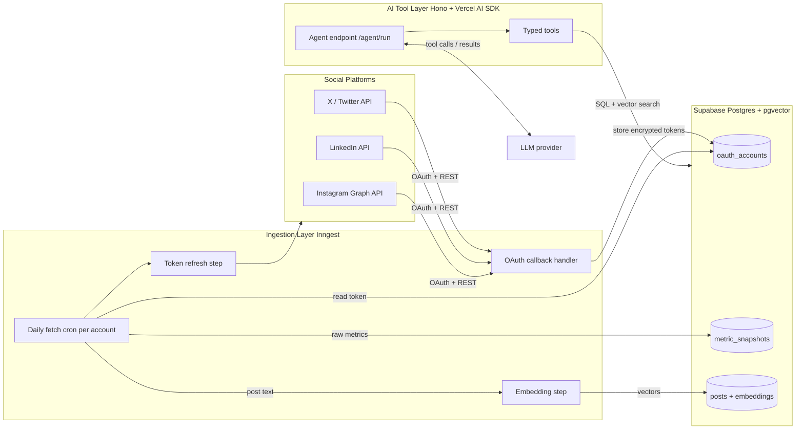

# AI-First Social Media Analytics & Action Engine — Blueprint

## Stack Decisions (recommendations where you left "or")

- **API framework: Hono.** It is the right call for a backend-only, tool-serving service. It is portable (Node/Bun/edge), tiny, has first-class middleware, and the Vercel AI SDK runs cleanly inside a Hono route. Next.js App Router would pull in a frontend toolchain you don't need. Use Next.js only if you later want a dashboard in the same repo.
- **Background jobs: Inngest.** Event-driven + cron, durable step functions, automatic retries, and concurrency/throttle controls map perfectly to "fetch per-account daily while respecting platform rate limits." Trigger.dev is a fine alternative; the architecture below is runner-agnostic.
- **AI runtime: Vercel AI SDK** `generateText`/`streamText` with `tools` (Zod-typed) and `stopWhen: stepCountIs(n)` for multi-step agent loops.
- **DB access: Drizzle ORM** (TypeScript-native, great with pgvector via `drizzle-orm` + `pgvector` column type). Supabase as the managed Postgres host.

## 1. System Architecture (data flow)



Flow summary:
1. **Connect**: User (or operator) initiates OAuth per platform. Callback exchanges code for tokens, encrypts them, stores in `oauth_accounts`.
2. **Ingest**: An Inngest cron (`daily`) fans out one event per connected account. Each run refreshes the token if expired, calls the platform API for account metrics + recent posts, writes a time-series `metric_snapshots` row and upserts `posts`.
3. **Enrich**: New/changed posts are sent to an embedding model; vectors stored on `posts.embedding` (pgvector).
4. **Serve to AI**: Hono exposes `/agent/run`. The Vercel AI SDK runs a tool-calling loop; tools query Postgres (time-series aggregations + vector similarity) and return structured JSON the LLM reasons over.

Key cross-cutting concerns: token encryption at rest, per-platform rate limiting (Inngest `throttle`/`concurrency`), idempotent upserts (dedupe by platform post id), and tenancy isolation (`user_id` on every row + Supabase RLS if multi-tenant).

## 2. Database Schema (Postgres + pgvector)

Enable extensions: `create extension if not exists vector;` and `pgcrypto` (for `gen_random_uuid`).

- **users** — owner of connected accounts.
  - `id uuid pk`, `email text unique`, `created_at timestamptz`.
- **oauth_accounts** — one row per connected social account. Tokens stored encrypted (AES-256-GCM via app-layer key, not plaintext).
  - `id uuid pk`, `user_id uuid fk -> users`, `platform text` (`x` | `linkedin` | `instagram`), `platform_account_id text`, `handle text`, `access_token_enc bytea`, `refresh_token_enc bytea`, `token_expires_at timestamptz`, `scopes text[]`, `status text` (`active`|`revoked`|`error`), `created_at`, `updated_at`.
  - `unique(user_id, platform, platform_account_id)`.
- **metric_snapshots** — append-only time-series of account-level metrics (one row per account per fetch/day).
  - `id bigserial pk`, `account_id uuid fk -> oauth_accounts`, `captured_at timestamptz`, `followers int`, `following int`, `impressions bigint`, `engagements bigint`, `profile_views int`, `raw jsonb` (full platform payload for future-proofing).
  - `unique(account_id, captured_at::date)` to keep it daily + idempotent; index `(account_id, captured_at desc)`.
- **posts** — content with per-post metrics and embedding.
  - `id uuid pk`, `account_id uuid fk`, `platform_post_id text`, `content text`, `media_urls text[]`, `posted_at timestamptz`, `likes int`, `comments int`, `shares int`, `impressions bigint`, `embedding vector(1536)` (match your model's dims), `raw jsonb`, `created_at`.
  - `unique(account_id, platform_post_id)`; HNSW index: `create index on posts using hnsw (embedding vector_cosine_ops);`.
- **agent_runs** (optional, Phase 3) — audit log of tool calls for observability.
  - `id uuid pk`, `user_id uuid`, `prompt text`, `steps jsonb`, `created_at`.

## 3. AI Tool Definitions (Vercel AI SDK, Zod-typed)

Each tool gets a clear description (the LLM reads it), a Zod `inputSchema`, and an `execute` that runs scoped SQL. All tools are user-scoped to prevent cross-tenant access.

- **`get_audience_trends`** — time-series of follower/engagement growth.
  - Input: `{ accountId, metric: 'followers'|'engagements'|'impressions', period: '7d'|'30d'|'90d', granularity?: 'day'|'week' }`.
  - Logic: aggregate `metric_snapshots` over the window, return series + computed deltas/growth rate. Lets the agent answer "is my audience growing?"
- **`search_past_posts`** — semantic search over post history.
  - Input: `{ accountId, query: string, limit?: number, since?: string }`.
  - Logic: embed `query`, run `embedding <=> $1` cosine search on `posts`, return top-k with content + metrics. Answers "find my posts about product launches that did well."
- **`get_top_posts`** — ranked best/worst performers.
  - Input: `{ accountId, metric: 'likes'|'impressions'|'engagement_rate', period, limit?: number, order?: 'top'|'bottom' }`.
  - Logic: rank `posts` by metric in window (engagement_rate computed in SQL). Feeds "what content works."
- **`get_account_summary`** — snapshot of current state across connected accounts.
  - Input: `{ userId }`.
  - Logic: latest `metric_snapshots` per account + post counts. Cheap context primer the agent calls first.
- **(Phase 3, "Action") `draft_post` / `schedule_post`** — write-path tools that compose content (optionally grounded by `search_past_posts`) and enqueue an Inngest publish job. Gate behind explicit confirmation.

Expose them via one Hono endpoint:

```ts
// POST /agent/run
const result = await generateText({
  model,
  system: 'You are a social media analytics agent...',
  prompt: userMessage,
  tools: { get_audience_trends, search_past_posts, get_top_posts, get_account_summary },
  stopWhen: stepCountIs(8),
});
```

## 4. Step-by-Step Implementation Plan

### Phase 1 — Foundation & one platform end-to-end (manual ingest)
- Scaffold Hono + TypeScript app, env config, Drizzle, connect Supabase, enable `vector`/`pgcrypto`.
- Create `users`, `oauth_accounts`, `metric_snapshots`, `posts` tables + indexes via Drizzle migrations.
- Implement token encryption helper (AES-256-GCM, key from env).
- Build OAuth connect + callback for **one** platform (recommend **X/Twitter** or **LinkedIn** — pick by which API access you already have).
- Build a manual `/dev/ingest/:accountId` route that fetches metrics + recent posts and writes rows. Validate the full path before automating.

### Phase 2 — Embeddings + AI tools (read-only agent)
- Add embedding generation (Vercel AI SDK `embed`/`embedMany`) and backfill `posts.embedding`; add HNSW index.
- Implement the 4 read tools (`get_audience_trends`, `search_past_posts`, `get_top_posts`, `get_account_summary`) with Zod schemas and user-scoped SQL.
- Stand up `/agent/run` with the tool-calling loop. Test with real prompts; verify the agent chooses tools correctly and results are accurate.

### Phase 3 — Automation, scale, and action tools
- Add Inngest: daily cron that fans out per active account, with token-refresh step, `throttle`/`concurrency` for rate limits, retries, and idempotent upserts; trigger embedding step on new posts.
- Add second/third platform behind a `PlatformAdapter` interface (normalize each API into the same `metric_snapshots`/`posts` shape).
- Add `agent_runs` audit logging + basic observability.
- (Optional) Add write/"action" tools (`draft_post`, `schedule_post`) gated behind confirmation, publishing via an Inngest job.

## Recommended repo layout

- `src/index.ts` — Hono app + route mounting
- `src/db/schema.ts`, `src/db/migrations/` — Drizzle
- `src/lib/crypto.ts` — token encryption
- `src/platforms/{x,linkedin,instagram}.ts` + `src/platforms/types.ts` — `PlatformAdapter`
- `src/ai/tools/*.ts`, `src/ai/agent.ts` — Vercel AI SDK tools + loop
- `src/inngest/{client.ts,functions.ts}` — jobs
- `src/routes/{oauth.ts,agent.ts}` — HTTP endpoints

## Open choices to confirm before building
- Which social platform to wire first in Phase 1 (drives the OAuth/adapter you build).
- Embedding model + dimension (e.g. OpenAI `text-embedding-3-small` = 1536) so the `vector(n)` column matches.
- Single-tenant (one operator) vs multi-tenant (Supabase RLS) — affects auth on `/agent/run`.
